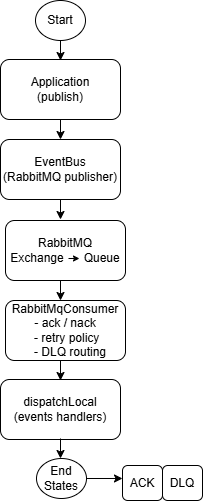

# Eventus

**Eventus** is a modular Java library for building **event-driven systems with explicit semantics**.

It focuses on defining **clear architectural contracts** for events, handlers, retries, idempotency, and failure handling, while deliberately separating **domain concerns** from **messaging infrastructure**.

> Eventus is **not** a message broker.  
> It is an architectural toolkit that makes event-driven behavior *intentional*, observable, and evolvable.

---

## Why Eventus exists

Many systems adopt messaging technologies (RabbitMQ, Kafka, SQS) but still suffer from:

- implicit and inconsistent retry logic  
- accidental coupling between services  
- infinite republish loops in consumers  
- duplicated side effects  
- unclear failure semantics  
- infrastructure details leaking into domain code  

Eventus exists to address these problems **at the architectural level**, not by hiding them behind framework magic.

---

## Core principles

Eventus is built around a small set of explicit assumptions:

- **Events represent facts that already happened**
- **Delivery is at-least-once by design**
- **Handlers must be idempotent**
- **Failures are explicit and observable**
- **Retries are a policy decision, not a broker default**
- **Infrastructure is replaceable**

These principles are enforced through **code-level contracts**, not conventions.

---

## Architecture overview



Eventus is structured as a multi-module project:

```
eventus/
├── eventus-core
├── eventus-transport-inmemory
├── eventus-transport-rabbitmq
├── eventus-spring-boot-starter (planned)
└── eventus-examples
```

### `eventus-core`
Defines the **transport-agnostic contracts**:

- `Event`
- `EventBus`
- `EventHandler`
- `RetryPolicy`
- Idempotency and failure boundaries

This module contains **no infrastructure code**.

---

### `eventus-transport-inmemory`
A deterministic, in-process transport used to:

- validate event semantics
- test retry behavior
- debug failure scenarios without infrastructure

This transport exists to **prove the architecture before introducing complexity**.

---

### `eventus-transport-rabbitmq`
A concrete RabbitMQ (AMQP) implementation that demonstrates how the core contracts map to a real broker.

It includes:

- explicit publisher and consumer separation  
- manual ack / nack handling  
- retry queues with TTL-based backoff  
- deterministic dead-letter routing  
- transport-level event envelopes  
- clear separation between **remote publish** and **local dispatch**

> Consumers never republish consumed messages.  
> Incoming events are dispatched locally to avoid infinite loops.

---

### `eventus-examples`
A minimal, end-to-end example that wires:

- RabbitMQ transport
- local event handlers
- retry behavior
- logging and observability

This module serves as **executable documentation**.

---

## Key design decisions

### Publish vs Dispatch
Eventus explicitly separates:

- **publishing events to the broker** (outgoing)
- **dispatching events to local handlers** (incoming)

This avoids a common class of bugs where consumers accidentally republish messages, creating infinite loops.

---

### Retry semantics
Retries are:

- explicit
- driven by a `RetryPolicy`
- observable through retry queues
- bounded and deterministic

Retry behavior is **not** delegated blindly to broker defaults.

---

### Failure handling
Failures are treated as first-class signals:

- retryable vs non-retryable
- bounded retry attempts
- deterministic DLQ routing

No silent requeues. No hidden behavior.

---

## Running the example

The `eventus-examples` module provides a minimal end-to-end demonstration
of publishing and consuming events using the RabbitMQ transport.

### Prerequisites
- Java 17+
- Maven 3.9+
- Docker

### Start RabbitMQ
Run RabbitMQ locally with management UI enabled:

```bash
docker run -d --name rabbitmq   -p 5672:5672 -p 15672:15672   rabbitmq:3-management
```

RabbitMQ will be available at:
- AMQP: `localhost:5672`
- Management UI: http://localhost:15672 (guest / guest)

### Build the project
From the repository root:

```bash
mvn clean install
```

### Run the example
Run the `Main` class in `eventus-examples`:

```bash
mvn -pl eventus-examples exec:java
```

Or run it directly from your IDE.

You should see logs indicating:
- event publication
- message consumption
- handler execution

To test retry behavior, throw an exception inside the example handler.

---

## What Eventus is *not*

- Not a replacement for RabbitMQ, Kafka, or SQS  
- Not a framework that hides messaging details  
- Not a magic abstraction over distributed systems  

Eventus makes trade-offs explicit instead of pretending they do not exist.

---

## Status

Eventus is currently an **architectural exploration and reference implementation**.

The goal is correctness, clarity, and evolvability — not feature completeness.

---

## Who this project is for

- Engineers working with event-driven systems
- Teams struggling with retries, DLQs, and failure semantics
- Developers who want to understand *why* EDA fails in practice
- Anyone interested in architecture-first design

---

## License

MIT
